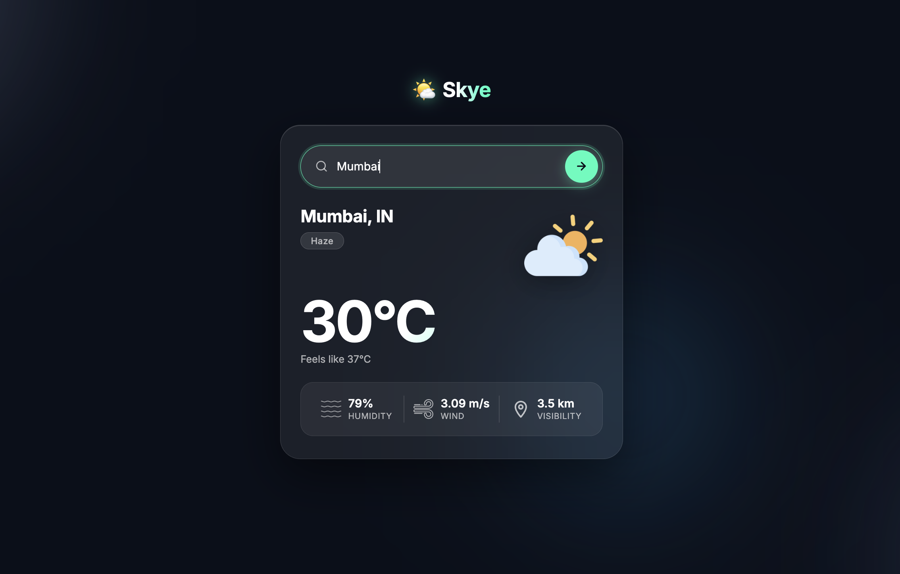

# 🌤️ Skye - Weather App

A modern and minimal Weather web application to get real-time weather conditions for any city instantly.  
Built with a sleek glassmorphism UI, smooth animations, and live weather data.

---

## 📸 Demo



---

## 🚀 Features

- 🔍 Search weather by city name  
- 🌡️ Real-time temperature & "feels like" data  
- 💧 Humidity, 💨 Wind Speed & 👁️ Visibility stats  
- 🖼️ Dynamic weather icons based on conditions  
- 🌈 Background adapts to current weather condition  
- ⌨️ Press **Enter** or click the arrow button to search  
- ❌ Friendly error messages for invalid city names  
- 🎨 Clean glassmorphism dark UI  

---

## 🛠️ Tech Stack

- HTML5  
- CSS3  
- JavaScript (Vanilla)  
- [OpenWeatherMap API](https://openweathermap.org/api)  

---

## 📂 Project Structure

```
weather-app/
├── images/
│   ├── clear.png
│   ├── clouds.png
│   ├── drizzle.png
│   ├── humidity.png
│   ├── mist.png
│   ├── rain.png
│   ├── search.png
│   ├── snow.png
│   └── wind.png
├── screenshots/
│   ├── demo.png
├── index.html
├── style.css
└── README.md
```

---

## ⚙️ Getting Started

### 1. Clone the repository

```bash
git clone https://github.com/kaushtub001/weather-app.git
```

### 2. Navigate into the project

```bash
cd weather-app
```

### 3. Run the app

Open `index.html` in your browser — no build step required.

---

## 🔑 API Setup

This app uses the **OpenWeatherMap API**.

1. Sign up at [openweathermap.org](https://openweathermap.org/) and get your free API key.  
2. Open `index.html` and replace the `apiKey` value:

```js
const apiKey = "YOUR_API_KEY_HERE";
```

---

## 💡 Usage

- Type any city name in the search bar  
- Press **Enter ↵** or click the **→** button  
- View live temperature, humidity, wind speed, and visibility  
- The background dynamically shifts based on the weather condition  

---

## 🌦️ Supported Weather Conditions

| Condition | Icon |
|-----------|------|
| Clear | ☀️ |
| Clouds | ☁️ |
| Rain | 🌧️ |
| Drizzle | 🌦️ |
| Snow | ❄️ |
| Mist / Haze / Fog | 🌫️ |
| Thunderstorm | ⛈️ |

---

## 📄 License

This project is open source and available under the [MIT License](LICENSE).
